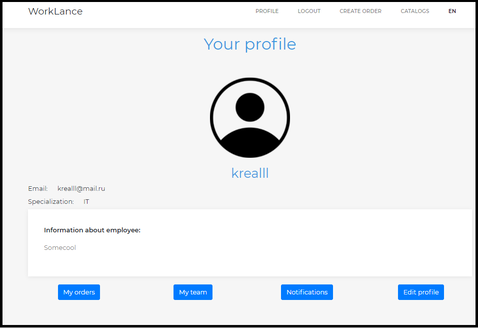
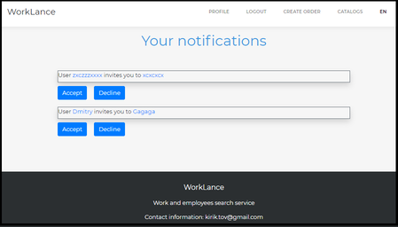
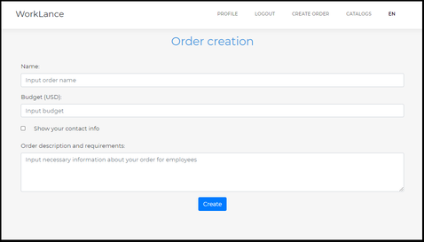
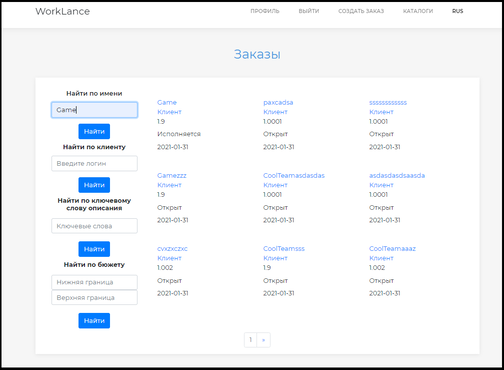
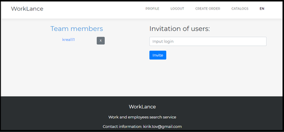
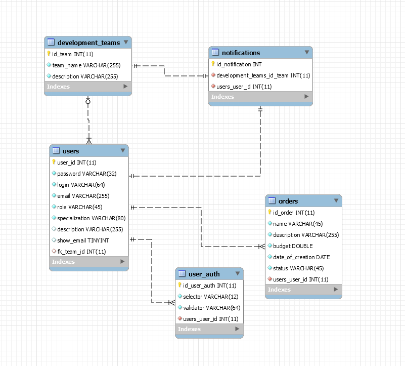
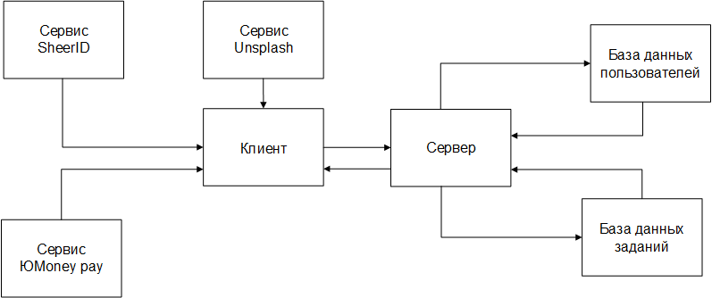

# Freelance
Freelance - work and employee search service. 

## Table of contents
1. [General info](#General-info)
2. [Features](#Features)
3. [Showcase](#Showcase)
4. [Deployment](#Deployment-order)
5. [Database structure](#Database-structure)
6. [Technologies](#Technologies)
7. [Schemes](#Schemes)
___
## General info
Worklance is a web-service that allows you to easily find orders, create orders, search for employees, contact with them and create teams.

#### Roles
- Guest
  - Can view start page
  - Can change localization
  - Can browse catalogs
  - Can search for orders, teams and employees in catalogs
  - Can sign in and sign up
  - Can view profiles, orders and team pages
- User 
  - Can do all the stuff, that guest can
  - Can edit his profile
  - Can view, accept or decline notifications
  - Can create, delete and edit orders and find his orders in catalog
  - Can log out
  - Can create team
- Manager
  - Can operate only one team at a time
  - Can view team profile
  - Can edit team info
  - Can delete team
  - Can invite users to team by sending them notifications
  - Can only decline notifications from other managers
  - Can remove members from team
___
## Features
### Full service localization
All text content that is on pages can be translated by one click 
from **English** to **Russian** and vice versa.

### Simple entities representation
Orders, teams and employees can be found in catalogs with page 
pagination and search forms.

### Contact info management
There is an abbility to show or hide your contact info from 
other users by one checkbox, that can be changed during profile edit
or order creation.

### Cookie tokens
Service store cookie tokens in database in order to to allow users
to log in easily.

### Notifications system
Users can view their notifications with invitations from team managers
and operate them

### Presence of links
Presence of links ease the way users can view profiles 
and pages of other users
___
## Showcase

___
## Deployment order
  - Clone repository
  - Edit configuration(Intellij) -> Deployment -> Application context(remove any value) -> Apply
  - File(Intellij)->Project Settings->Modules->Web Resource Directories->Choose corresponding webapp(src/main/webapp) directory path->Apply 
  

___
## Database structure

___
## Technologies
- [JDK 8](https://www.oracle.com/java/technologies/javase/javase-jdk8-downloads.html) - Java Development kit 8
- [Maven](https://maven.apache.org/) - Project build tool
- [Tomcat](http://tomcat.apache.org/) - Servlet container
- [Java EE](https://www.oracle.com/java/technologies/java-ee-glance.html) - Java Servlet, JSP(Java server pages)
- [MySQL](https://www.mysql.com/) - Open source SQL database
- [JDBC](https://docs.oracle.com/javase/8/docs/technotes/guides/jdbc/) - Java Database Connectivity API
- [JSTL](https://docs.oracle.com/javaee/5/tutorial/doc/bnake.html) - Library for JSP
- [Log4j](https://logging.apache.org/log4j/2.x/) - Logging library
- [TestNG](https://testng.org/doc/) - Testing framework

##Schemes

